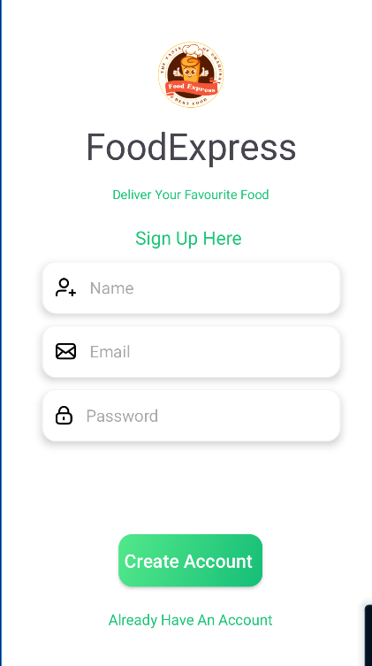
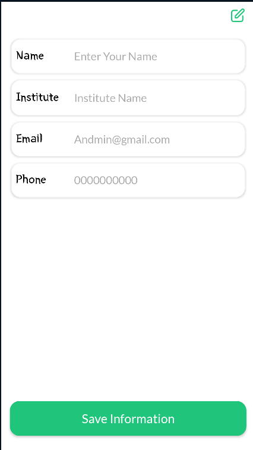
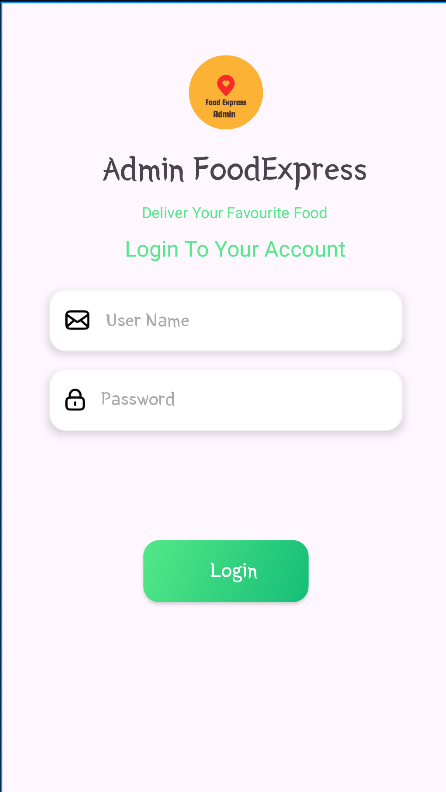
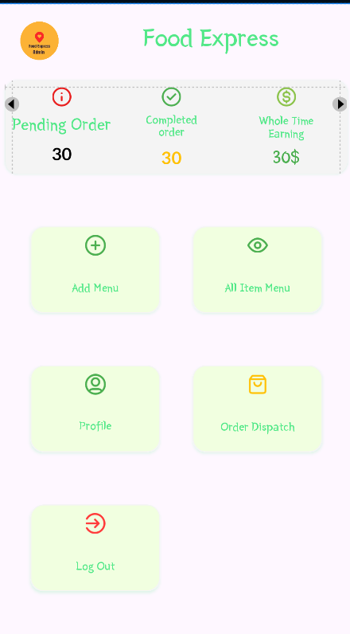
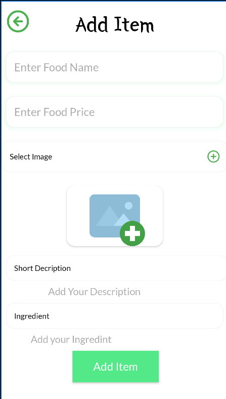

# 🍽️ Food Express

**Food Express** is a dual Android app solution built with Kotlin, designed to simplify food ordering for users and food item management for canteen owners. The project consists of two separate apps:

- 👤 **User App** – For customers who browse, search, and order food  
- 🧑‍🍳 **Admin App** – For canteen owners to upload items and manage orders

---

## 🔗 Firebase Integration

- **Authentication**
  - Email/Password (Both apps)
  - Google Sign-In (User App only)
- **Realtime Database** – All food items, orders, and user data
- **Firebase Storage** – For uploading and storing food item images

---

## 📱 User App – Features

- 🔐 **Login & Authentication**
  - Firebase Email/Password login
  - Google Sign-In
  - Logout and Profile management

- 🍔 **Food Browsing**
  - View all food items from all canteens
  - Live syncing with Firebase Realtime Database

- 🔍 **Search & Sort**
  - Search food by name or description
  - Sort by price, name, or popularity

- 🛒 **Order Placement & Tracking**
  - Select food items and place orders
  - Track order status in real-time
  - View previous 5 orders

---

## 🧑‍🍳 Admin App – Features

- 🧾 **Canteen Authentication**
  - Firebase Email/Password login for canteen owners

- 🍱 **Food Item Management**
  - Add new food items with image, description, and price
  - Edit or delete food items

- 📦 **Order Management**
  - View incoming orders
  - Accept or reject orders
  - Update order status

- 📊 **Profit Overview**
  - See basic profit summary
  - Daily or order-wise revenue tracking (if implemented)

---

## 🛠️ Tech Stack

| Technology       | Purpose                         |
|------------------|----------------------------------|
| Kotlin           | Android App Development         |
| Firebase Auth    | User and Admin Authentication   |
| Firebase Realtime DB | Store food, users, orders data |
| Firebase Storage | Food image upload & retrieval   |
| Material UI      | Clean and user-friendly UI      |

---

📱 User App:

| Login              | Profile             | 
| ----------------------- | ----------------------- |
|  |  |


🧑‍🍳 Admin App:

| Login              | Home             | Add Item            | 
| ----------------------- | ----------------------- | ----------------------- | 
|  |  |  | 

---

## ⚙️ Setup Instructions

1. Clone the repository for both apps:
   ```bash
   git clone git@github.com:Pratham1803/Food-Express.git   
